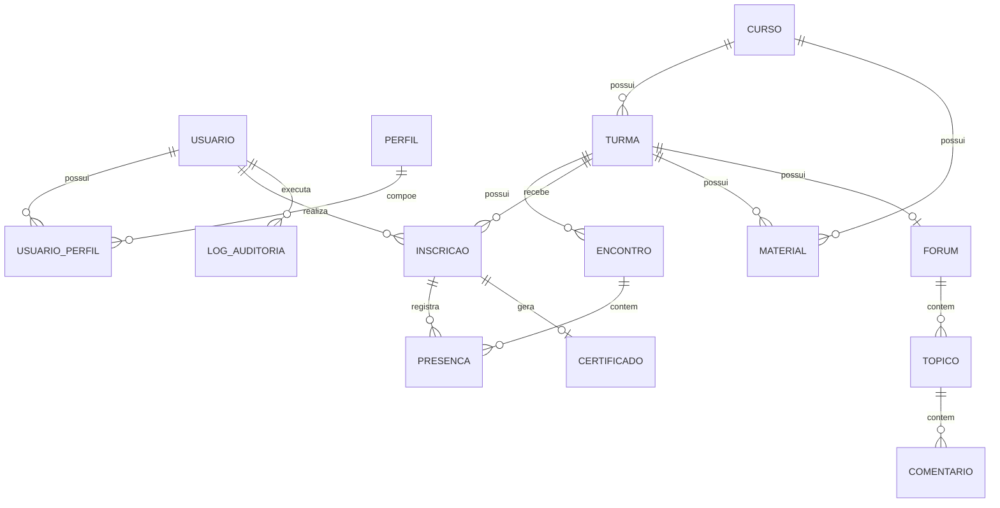

# Especificacao Inicial de Produto - Escola LaBC de Inovacao Publica

## 1. Proposito

Esta especificacao organiza os principais fluxos, modulos, telas, entidades e regras iniciais da Escola LaBC de Inovacao Publica para orientar prototipacao, arquitetura e desenvolvimento do MVP.

## 2. Modulos do MVP

### 2.1 Autenticacao e Usuarios

Funcoes:

- login;
- recuperacao de senha;
- cadastro e edicao de usuarios;
- perfis e permissoes;
- bloqueio e ativacao;
- historico de participacao.

Perfis:

- administrador geral;
- gestor LaBC;
- instrutor/facilitador;
- participante;
- moderador;
- convidado/observador.

### 2.2 Cursos e Turmas

Funcoes:

- cadastro de curso;
- edicao de curso;
- publicacao e arquivamento;
- cadastro de turma;
- associacao de instrutor;
- controle de vagas;
- definicao de criterios de certificacao.

### 2.3 Inscricoes

Funcoes:

- catalogo de cursos;
- detalhe do curso;
- escolha de turma;
- inscricao;
- cancelamento;
- lista de espera;
- lista de inscritos para gestores.

### 2.4 Materiais

Funcoes:

- upload de arquivos;
- cadastro de links;
- associacao a curso ou turma;
- visibilidade por perfil;
- acesso pela area do participante.

### 2.5 Presenca

Funcoes:

- cadastro de encontros;
- lista de presenca;
- registro manual;
- check-in por QR Code, se aprovado;
- justificativa;
- calculo de frequencia.

### 2.6 Certificados

Funcoes:

- identificacao de concluintes;
- emissao de PDF;
- codigo unico;
- QR Code;
- historico de emissao;
- cancelamento ou invalidacao, se necessario;
- download pelo participante.

### 2.7 Validacao Publica

Funcoes:

- consulta por codigo;
- acesso por QR Code;
- exibicao de autenticidade;
- exibicao de dados minimos;
- aviso para certificado inexistente, invalido ou cancelado.

### 2.8 Relatorios

Funcoes:

- indicadores gerais;
- filtros por periodo, curso, turma, secretaria e tema;
- exportacao CSV/XLSX;
- totalizadores de participacao, conclusao, certificados e carga horaria.

## 3. Mapa de Telas do MVP

### Publicas

- Login.
- Recuperacao de senha.
- Catalogo publico de cursos, se aprovado.
- Detalhe publico de curso, se aprovado.
- Validacao publica de certificado.

### Participante

- Minha area.
- Meus cursos.
- Detalhe da minha inscricao.
- Materiais.
- Minha frequencia.
- Meus certificados.
- Forum do curso/turma, se aprovado.

### Instrutor

- Minhas turmas.
- Lista de participantes.
- Registro de presenca.
- Materiais da turma.
- Forum da turma, se aprovado.

### Gestor LaBC

- Dashboard.
- Usuarios.
- Cursos.
- Turmas.
- Inscricoes.
- Materiais.
- Presencas.
- Certificados.
- Relatorios.

### Administrador

- Configuracoes.
- Perfis e permissoes.
- Logs de auditoria.
- Parametros da plataforma.

## 4. Regras de Negocio Iniciais

### Cursos

- Apenas gestores e administradores podem criar cursos.
- Curso precisa ter nome, ementa, carga horaria, modalidade e status.
- Curso arquivado nao deve aceitar novas inscricoes.
- Curso publicado pode aparecer no catalogo conforme regra de visibilidade.

### Turmas

- Toda turma deve estar vinculada a um curso.
- Turma deve ter vagas, datas, horario, modalidade e responsavel.
- Turma encerrada nao deve aceitar novas inscricoes.
- Turma pode ter um ou mais encontros.

### Inscricoes

- Participante so pode se inscrever em turma publicada e com vagas disponiveis.
- Sistema deve impedir inscricao duplicada na mesma turma.
- Lista de espera pode ser usada quando vagas se esgotarem.
- Cancelamento deve manter historico.

### Presenca

- Presenca deve ser registrada por encontro.
- Registro manual deve identificar responsavel, data e hora da alteracao.
- Correcoes de presenca devem gerar log de auditoria.
- Frequencia deve ser calculada com base nos encontros validos da turma.

### Certificacao

- Certificado so deve ser emitido para participante apto.
- Apto significa atender ao criterio de frequencia e conclusao definido para a turma.
- Cada certificado deve ter codigo unico.
- Certificado deve conter QR Code para validacao publica.
- Reemissao deve preservar historico.

### Validacao Publica

- Consulta publica nao exige login.
- Validacao deve exibir apenas dados minimos.
- CPF nao deve ser exibido integralmente.
- Certificado cancelado ou invalido deve aparecer com status correspondente.

### Auditoria

- Acoes sensiveis devem gerar log.
- Logs devem conter usuario, acao, entidade, data/hora e resumo da alteracao.
- Logs nao devem ser editaveis pela interface comum.

## 5. Modelo Conceitual Inicial

## 6. Entidades e Campos Iniciais

### Usuario

- id;
- nome;
- cpf;
- email;
- telefone;
- endereco;
- orgao_secretaria;
- cargo;
- matricula;
- instituicao_origem;
- vinculo;
- status;
- criado_em;
- atualizado_em.

### Curso

- id;
- nome;
- descricao;
- objetivos;
- ementa;
- carga_horaria;
- modalidade;
- publico_alvo;
- status;
- tema;
- criado_por;
- criado_em;
- atualizado_em.

### Turma

- id;
- curso_id;
- nome;
- data_inicio;
- data_fim;
- vagas;
- local;
- link_online;
- modalidade;
- criterio_frequencia_minima;
- status;
- instrutor_id.

### Encontro

- id;
- turma_id;
- data;
- horario_inicio;
- horario_fim;
- modalidade;
- local;
- link_online;
- status.

### Inscricao

- id;
- usuario_id;
- turma_id;
- status;
- data_inscricao;
- origem;
- percentual_frequencia;
- apto_certificado.

### Presenca

- id;
- inscricao_id;
- encontro_id;
- status;
- metodo;
- registrado_por;
- registrado_em;
- justificativa.

### Certificado

- id;
- inscricao_id;
- codigo_validacao;
- status;
- data_emissao;
- data_cancelamento;
- motivo_cancelamento;
- arquivo_pdf;
- hash_documento.

### Material

- id;
- curso_id;
- turma_id;
- titulo;
- tipo;
- url;
- arquivo;
- visibilidade;
- publicado_por;
- publicado_em.

### LogAuditoria

- id;
- usuario_id;
- acao;
- entidade;
- entidade_id;
- resumo;
- ip;
- criado_em.

## 7. APIs Iniciais

### Autenticacao

- POST /auth/login
- POST /auth/logout
- POST /auth/recuperar-senha
- GET /auth/me

### Usuarios

- GET /usuarios
- POST /usuarios
- GET /usuarios/{id}
- PATCH /usuarios/{id}
- PATCH /usuarios/{id}/status
- GET /usuarios/{id}/historico

### Cursos

- GET /cursos
- POST /cursos
- GET /cursos/{id}
- PATCH /cursos/{id}
- PATCH /cursos/{id}/publicar
- PATCH /cursos/{id}/arquivar

### Turmas

- GET /turmas
- POST /turmas
- GET /turmas/{id}
- PATCH /turmas/{id}
- GET /turmas/{id}/inscritos
- GET /turmas/{id}/encontros

### Inscricoes

- POST /turmas/{id}/inscricoes
- GET /minhas-inscricoes
- PATCH /inscricoes/{id}/cancelar

### Presencas

- POST /encontros/{id}/presencas
- GET /inscricoes/{id}/frequencia
- POST /encontros/{id}/qr-code
- POST /presencas/check-in

### Certificados

- POST /inscricoes/{id}/certificado
- GET /meus-certificados
- GET /certificados/{id}/download
- GET /validar-certificado/{codigo}

### Materiais

- GET /turmas/{id}/materiais
- POST /materiais
- PATCH /materiais/{id}
- DELETE /materiais/{id}

### Relatorios

- GET /relatorios/dashboard
- GET /relatorios/participacao
- GET /relatorios/certificados
- GET /relatorios/exportar

## 8. Criterios de Sucesso do MVP

- Um gestor consegue cadastrar curso e turma.
- Um participante consegue se inscrever.
- Um instrutor consegue registrar presenca.
- O sistema calcula frequencia.
- Um certificado PDF e emitido para participante apto.
- O certificado pode ser validado publicamente por codigo ou QR Code.
- Gestores conseguem consultar indicadores basicos.
- Acoes sensiveis ficam auditadas.

