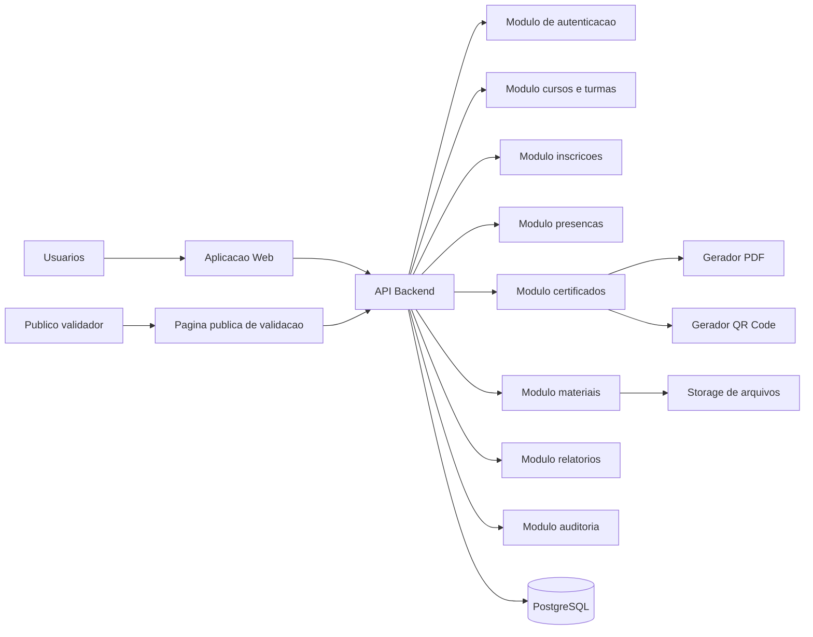

# Arquitetura Tecnica - Escola LaBC de Inovacao Publica

## 1. Objetivo

Definir uma arquitetura inicial para o MVP da Escola LaBC de Inovacao Publica, preparada para evoluir com integracoes futuras sem aumentar a complexidade da primeira entrega.

## 2. Principios

- MVP operacional antes de funcionalidades avancadas.
- Baixo custo de manutencao.
- Stack comum e sustentavel.
- Modularidade por dominio.
- Banco relacional como fonte de verdade.
- Controle de acesso por perfil.
- Auditoria em acoes sensiveis.
- Dados pessoais tratados com exposicao minima.
- Certificados verificaveis publicamente sem login.

## 3. Stack Recomendada

### Opcao preferencial

- Frontend: Next.js com React e TypeScript.
- Backend: Next.js API routes ou NestJS, conforme padrao da equipe de desenvolvimento.
- Banco de dados: PostgreSQL.
- ORM: Prisma.
- Autenticacao: credenciais locais no MVP, com camada preparada para SSO futuro.
- Arquivos: storage compativel com S3 ou storage institucional.
- PDF: geracao server-side.
- QR Code: geracao server-side com URL publica de validacao.
- Deploy: Docker.
- Observabilidade: logs estruturados, auditoria em banco e monitoramento basico.

### Justificativa

Next.js permite entregar uma aplicacao web responsiva com areas publicas e autenticadas, mantendo boa produtividade. PostgreSQL oferece integridade relacional para usuarios, turmas, inscricoes, presencas e certificados. Prisma reduz complexidade de acesso a dados e facilita evolucao do schema.

## 4. Visao de Componentes



## 5. Modulos Backend

### Auth

Responsavel por:

- login;
- logout;
- sessao/token;
- recuperacao de senha;
- usuario autenticado;
- preparacao para SSO futuro.

### Usuarios e Perfis

Responsavel por:

- cadastro de usuarios;
- atribuicao de perfis;
- ativacao e bloqueio;
- historico do participante;
- controle de permissoes.

### Cursos e Turmas

Responsavel por:

- CRUD de cursos;
- publicacao e arquivamento;
- CRUD de turmas;
- associacao de instrutores;
- configuracao de criterios de certificacao;
- encontros da turma.

### Inscricoes

Responsavel por:

- inscricao em turmas;
- cancelamento;
- lista de espera;
- controle de vagas;
- area do participante.

### Presencas

Responsavel por:

- registro manual;
- check-in por QR Code, se aprovado;
- calculo de frequencia;
- justificativas;
- logs de correcoes.

### Materiais

Responsavel por:

- upload;
- cadastro de links;
- associacao a curso ou turma;
- controle de visibilidade.

### Certificados

Responsavel por:

- identificacao de aptos;
- emissao de PDF;
- codigo unico;
- QR Code;
- historico de emissao;
- cancelamento/inativacao;
- validacao publica.

### Relatorios

Responsavel por:

- indicadores do dashboard;
- filtros;
- exportacao;
- agregacoes por secretaria, periodo, curso, turma e tema.

### Auditoria

Responsavel por:

- registrar acoes sensiveis;
- preservar rastreabilidade;
- apoiar investigacao administrativa.

## 6. Fronteiras de Permissao

| Perfil | Permissoes principais |
|---|---|
| Administrador geral | Configuracoes, usuarios, perfis, cursos, turmas, certificados, relatorios e auditoria. |
| Gestor LaBC | Cursos, turmas, inscricoes, presencas, certificados, materiais e relatorios. |
| Instrutor | Suas turmas, materiais, lista de participantes, presencas e forum. |
| Participante | Inscricoes, materiais permitidos, frequencia, certificados e forum. |
| Moderador | Moderacao de topicos e comentarios. |
| Convidado/observador | Conteudos publicos ou acessos restritos definidos. |

## 7. Estrategia de Autenticacao

MVP:

- autenticacao local por e-mail e senha;
- senha armazenada com hash forte;
- sessao ou token com expiracao;
- controle de permissao no backend;
- protecao de rotas no frontend.

Futuro:

- adaptador para login institucional;
- SSO via provedor municipal, se disponivel;
- mapeamento automatico de dados de servidores.

## 8. Estrategia de Certificados

Cada certificado deve possuir:

- id interno;
- codigo publico de validacao;
- hash do documento ou metadados essenciais;
- status;
- data de emissao;
- arquivo PDF;
- QR Code com URL publica.

Pagina publica de validacao:

- nao exige login;
- consulta apenas por codigo;
- nao exibe CPF integral;
- exibe status claro: valido, cancelado, invalido ou nao encontrado.

## 9. Estrategia de Auditoria

Eventos minimos:

- criacao, edicao e bloqueio de usuario;
- atribuicao de perfil;
- criacao, publicacao e arquivamento de curso;
- criacao e encerramento de turma;
- inscricao e cancelamento;
- registro e alteracao de presenca;
- emissao, reemissao e cancelamento de certificado;
- alteracao de configuracoes.

Campos minimos:

- usuario;
- acao;
- entidade;
- entidade_id;
- resumo;
- data/hora;
- IP, quando disponivel.

## 10. Estrategia de Ambientes

### Desenvolvimento

- ambiente local com Docker;
- banco local;
- seed de usuarios e dados ficticios;
- logs em console.

### Homologacao

- ambiente compartilhado;
- dados de teste controlados;
- acesso para gestores LaBC;
- validacao de fluxos.

### Producao

- backup configurado;
- logs persistidos;
- monitoramento basico;
- politicas de acesso;
- armazenamento de arquivos definitivo.

## 11. Padrao de API

- REST para o MVP.
- JSON como formato padrao.
- HTTP status codes consistentes.
- Paginacao em listas.
- Filtros por query string.
- Erros padronizados.
- Autorizacao validada no backend.

Formato de erro sugerido:

```json
{
  "error": "VALIDATION_ERROR",
  "message": "Dados invalidos.",
  "details": [
    {
      "field": "email",
      "message": "E-mail obrigatorio."
    }
  ]
}
```

## 12. Riscos Tecnicos

| Risco | Mitigacao |
|---|---|
| Indefinicao do storage | Criar camada de abstracao para arquivos. |
| Mudanca futura para SSO | Isolar autenticacao em modulo/adaptador. |
| Certificado com regras juridicas variaveis | Template configuravel e log de emissao. |
| Exposicao indevida de dados pessoais | Validacao publica com dados minimos. |
| Relatorios lentos no futuro | Indices e agregacoes planejadas desde o inicio. |

